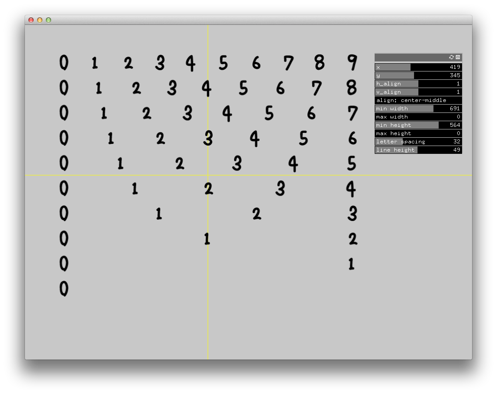

ofxTextAlign
============
by nariakiiwatani

Abstract
------------
addon for support drawing text aligned.
only monospaced fonts works good.
(in the future maybe I will support proportional ones...XD)

supports...
- horizontal align(left,center,right)
- vertical align(top,middle,bottom)
- bounding box limit(min width, max width, min height, max height)

