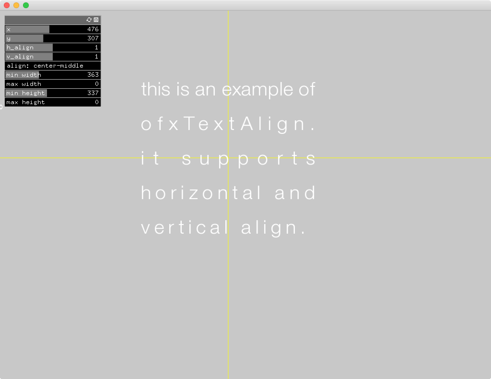
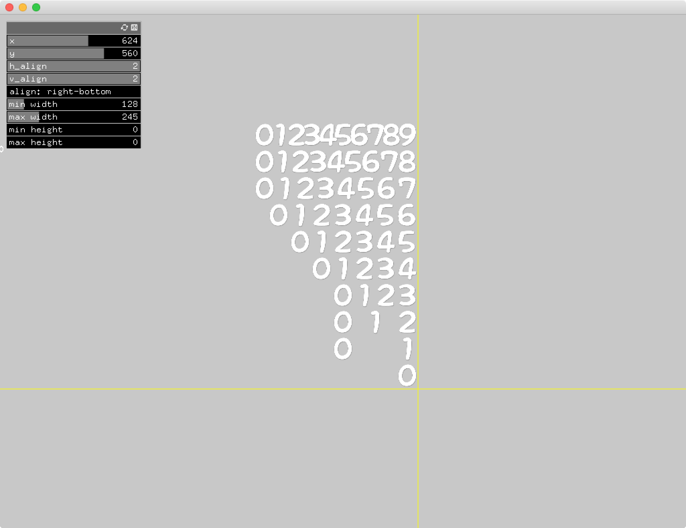

# ofxTextAlign

## What can it do
With this addon, you can draw texts in various align.  
e.g. center-bottom aligned, fit in a rect,,,


center-middle align with min width and min height set.  


right-bottom align with min width and max width set.


## How to use

### TrueTypeFont
In case of using ttf, simply load a font and draw string.

```
	ofxTextAlignTTF text;

	text.load(OF_TTF_SANS, fontsize);
	text.draw("some cool text", x,y);
```

### Other than TTF
You have to code a bit.

```
class YourClass : public ofxTextAlign
{
	const char* drawChar(const char *str, float x, float y);
	float getCharWidth(char ch) const;
	float getLineHeight() const;
};

const char* YourClass::drawChar(const char *str, float x, float y)
{
	// draw the first charactor of str as (x,y) position to be left-top point.
	string ch;
	ch.assign(str, 1);
	ofDrawBitmapString(ch, x, y);
	// and return pointer to next charactor.
	return str+1;
}

float YourClass::getCharWidth(char ch) const
{
	// return width of each charactor.
	// If it is constant, the text will be monospaced.
	return 32;
}
float YourClass::getLineHeight() const
{
	// return default line height. It may be ignored by setting min/max height.
	return ofTrueTypeFont::getLineHeight();
}

```

## License
MIT License.

